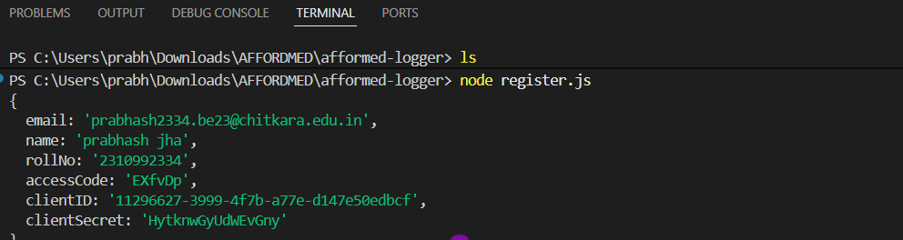
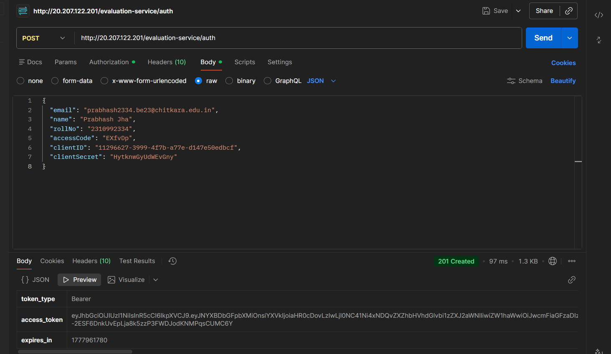
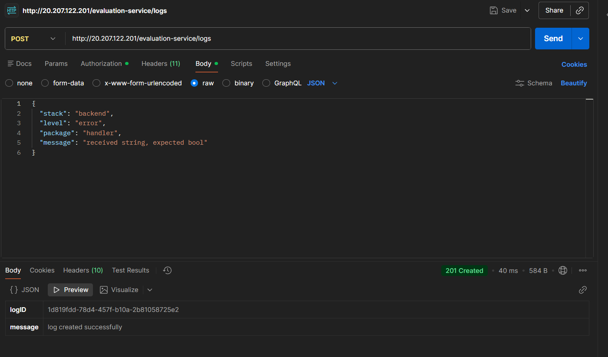
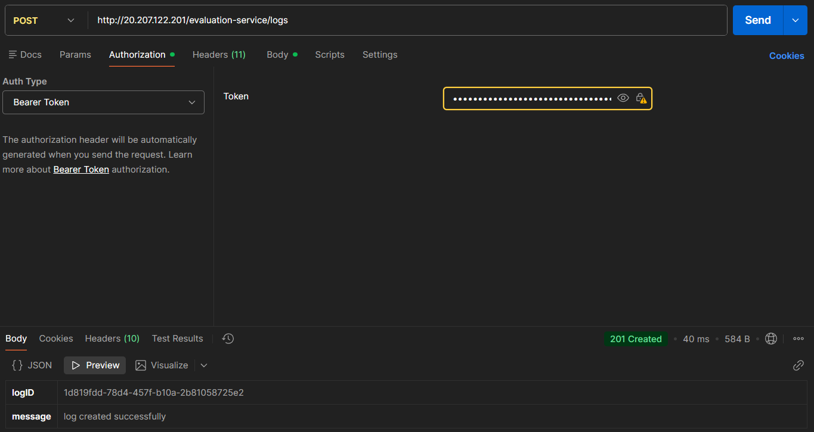

#  Logging Middleware (Node.js)

## Project Overview

This project implements a **custom logging middleware** in Node.js that sends structured logs to an external evaluation server using REST APIs.

---

##  Objectives

* Register application and obtain API credentials
* Generate authentication token
* Build a reusable log function

---

## Tech Stack

* Node.js
* Express.js
* Axios
* Dotenv
* Postman (for testing)

---

## Project Structure

```
project/
│── server.js       
│── logger.js       
│── .env            
│── package.json
```

---


## 📸 Screenshots

### 🔹 Register API Response



### 🔹 Auth Token Response



### 🔹 Log API Success






## 🚀 Features

* Reusable logging middleware
* Token-based authentication
* API integration using Axios
* Clean and modular code structure

---

## 🏁 Conclusion

This project demonstrates how to build and integrate a **custom logging system** in a Node.js backend using external APIs and middleware design.

---

## 👨‍💻 Author

* Your Name
* Your GitHub Profile

---
